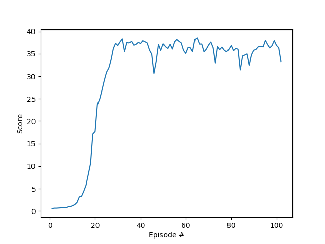

## Learning Algorithm
The algorithm can run in two modes, trained and untrained.

In the **trained mode** an agent is loaded and interacts with the environment. During the interaction there is no learning taken place, and it is used as a demonstration of its capabilities.

In the **untrained mode** the agent learns a new task, consisting in following a green bubble applying changes in the joints of an arm. The agent was created implementing a DDPG based on the code provided by Udacity ([ddpg-pendulum](https://github.com/udacity/deep-reinforcement-learning/tree/master/ddpg-pendulum)) and adapted to this environment.

The DDPG contains an actor and a critic, and each of them makes usage of two neural networks, the local ad the target. The actor models contain two fully-connected layers of 256 and 128 units activated by the relu function and an output layer of 1 unit activated by the tanh function. The critic models contain two fully-connected layers of 400 and 300 units respectively activated by the relu function, and an output layer. The agent contains also a replay buffer used to train the networks.

When the agent receives the state of the environment it uses the local network of the actor to choose the action to take by each arm, and includes some noise that ensures some exploration. The actions are sent to the environment, that returns the rewards, new states and the status of the episode (finished or not). The agent stores the experiences (states, actions, rewards, next states and episode status) in the replay buffer. In each episode the agent enters in the 'learn' phase.

During the learn phase the agent randomly selects 128 experiences, the actor uses them to estimate the next actions using it's target model and the critic uses the 128 experiences and the next actions from the actor to obtain a target Q with the target network. To obtain the target Q the discount factor is set to 0.99. The critic uses its local model to obtain the expected Q and, with both Qs, computes the loss using ADAM to update its local model.

Once the critic is updated, it's the turn for the actor. The actor uses its local model to predict actions, and the local model of the critic to estimate the loss. This loss is used by the actor to finally update it's local network using ADAM.

With the local networks of both, actor and critic, already updated, it's the turn for the target models. Both target networks softly update the weights to be 0.001 times the weights of the local network and 0.999 times the  weights of the target network.

This approach solves the problem in 100 episodes. Another solutions that were tested with worst results are:
* Update the weights every 4 steps. Updating every step is stable enough.
* Use a non-normal (linear) noise. Produces too much exploration.
* Use deeper or simpler models.
* Use a much bigger (1024 instead of 128) number of experiences to learn. The learning takes longer to happen the first time and the increment on experiences doesn't compensate it.
* Use a smaller (0.90 instead of 0.99) discount factor. The agent focuses less in the long term reward and it affects its performance. In this task is very important to put the arm in a position that allows the agent to follow the bubble movement.

## Rewards
The graph below shows the average score obtained in the last 100 episodes. The agent solves the environment in the first 100 episodes.

## Ideas For Future Work
This agent uses a ddpg. It would be interesting to perform the task with other algorithms to compare them:
* A3c: [paper](https://arxiv.org/abs/1602.01783)
* Q-prop: [paper](https://arxiv.org/abs/1611.02247)
* A2c
* GAE: [paper](https://arxiv.org/abs/1506.02438)
